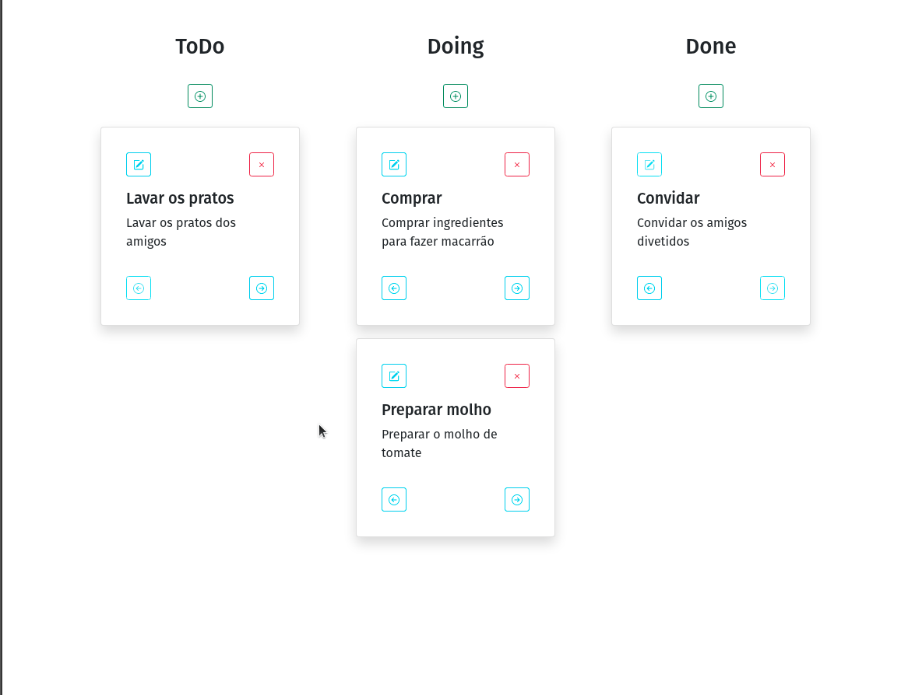

# Quadro Kanban
Desafio técinico - Fullstack -
Desenvolver um projeto em uma semana.

## Descrição do Projeto
A aplicação auxilia na organização de pequenas tarefas 
criando, atualizando e fechando cards. O desafio técnico
exige que o servidor seja feito em Node e Express e o cliente
em React.




### Pré-requisitos

Antes de começar, você vai precisar ter instalado em sua máquina [Node.js](https://nodejs.org/en/)

### Rodando o Back End (servidor)

```bash
# Clone este repositório
$ git clone https://github.com/tiagoharumitsukodama/quadro_kanban.git

# Acesse a pasta do projeto no terminal/cmd
$ cd quadro_kanban

# Vá para a pasta BACK
$ cd BACK

# Instale as dependências
$ npm install

# Crie um arquivo .env na pasta BACK com as seguintes variáveis ambientes: 
#
# PORT=5000
# ACCESS_TOKEN_SECRET=segredo
# USER_NAME=letscode
# USER_PASSWORD=lets@123
#
# O único usuário cadastrado é "letscode" com a senha "lets@123"
# O arquivo .env.example dá uma sugestão de como deve ser.

# Vá para a pasta src
$ cd src

# Execute a aplicação
$ node app.js

# O servidor inciará na porta:5000
```

### Rodando o Front End (client)

```bash
# Em um outro terminal, acesse a pasta quadro_kanban
$ cd quadro_kanban

# Vá para a pasta client
$ cd FRONT/client

# Instale as dependências
$ npm install

# Execute a aplicação em modo de desenvolvimento
$ npm run start

# O servidor inciará na porta:3000 - acesse <http://localhost:3000> 

# Por se tratar de uma demontração, página de acesso aceita qualquer valor
# e dá o token de acesso como se fosse o usuário "letscode".
```


### 🛠 Tecnologias

As seguintes ferramentas foram usadas na construção do projeto:

- [Bootstrap](https://getbootstrap.com/)
- [Express](https://expressjs.com/)
- [Jwt](https://jwt.io/)
- [Node.js](https://nodejs.org/en/)
- [React](https://pt-br.reactjs.org/)
- [Sequelize](https://sequelize.org/)
- [Sqlite](https://www.sqlite.org/index.html)


